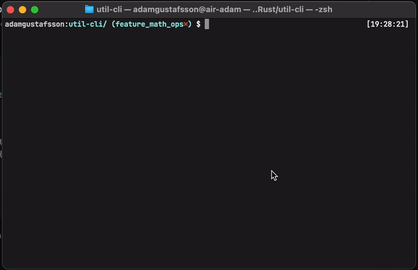
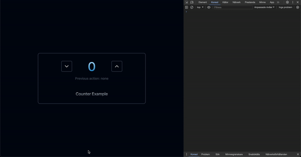

# **Halloj** 👋

Här är ett litet urval av vad jag gjort. Mycket av det jag gör på min fritid handlar om att lära sig nya saker och att bibehålla flexibilitet och en bred kunskap. Därför är mycket av det jag gör mindre experiment. Jag har försökt ge korta beskrivningar av projekten och målen med dem för att göra syftet med dem tydligare. Projekten är ett urval av lite webb och lite system. Projekten är skrivna under väldigt olika perioder och jag kan garantera att jag utvecklats en hel del sedan många av dem skrevs.

### [Cryptopals-utmaningar i Rust](https://github.com/adam0215/rs-cryptopals)

[Cryptopals](https://cryptopals.com/) är en samling utmaningar som handlar om att implementera olika typer av kryptografiska algoritmer och dylikt. Jag ville lära mig mer om kryptografi på en lägre nivå, så jag testade ett par. Utmaningen går ut på att implementera sakerna själv, därför använde jag inga färdiga kryptobibliotek eller liknande.

**Mål med projektet**

- Lära mig mer om kryptografi och relaterade ämnen
- Träna på bitvisa operationer

### ARL: En parser för enkla mattetal i terminalen

Inspirerad av "stack-oriented programming" och använder sig av "omvänd polsk notation" för att ta hänsyn till prioriteringsregler. Har en inbyggd funktion för att räkna ut medelvärde bl.a. Mattetal kan se triviala ut på ytan – och de är nog det till stor del beroende på vem du frågar – men man måste ändå ta hänsyn till prioriteringsregler och liknande vilket gör det mer utmanande. För att ta hänsyn till dessa tog jag bland annat "omvänd polsk notation" till hjälp. Detta projekt skrev jag när jag var relativt ny till Rust.



**Mål med projektet**

- Lära mig mer om lexing och parsing och hur dessa kan implementeras
- Lära mig mer om stack-oriented programming
- Lära mig mer om "omvänd polsk notation"
- Utvecklas i Rust

### PromptLib: Ett prompt-bibliotek från AI-boomen

_(Detta projekt funkar inte längre pga. Planetscale (databasleverantören) har ändrat sin affärsmodell.)_ PromptLib var ett projekt jag skrev när ChatGPT började bli stort och OpenAI:s chat-API:er var relativt nysläppta till allmänheten. Idén var ett bibliotek med "prompts" där man kunde spara antingen dynamiska eller statiska promptar. En dynamisk prompt har stöd för att lägga in ett "tomt" utrymme i texten som du kan anpassa varje gång du vill använda den. T.ex:

```
Prompt: Du är en expert på [<AI:ns roll: dynamisk variabel>]... resten av prompten ...
```

Statiska promptar är helt enkelt en statisk text. Dessa kunde man tagga med nyckelord och de lagrades sedan i en MySQL-databas hos Planetscale. Man kunde sedan enkelt skicka en prompt direkt till en inbyggd chatt på sidan som kommunicerade med ChatGPT 3.5-API:n så man slapp lämna PromptLib.

**Mål med projektet**

- Applicera ChatGPT-API:n i praktiken
- Applicera "fullstack"-Typescript-ramverk i praktiken
- Fräscha upp och bibehålla mina kunskaper om MySQL, relationsdatabaser och kommunikationen med dem från en webbsida
- Testa en Javascript databas-ORM, i detta fallet Drizzle ORM

### Phaseshift: "Server-only" Interaktiva gränssnitt

Inspirerad av Liveview från Phoenix-ramverket i Elixir ville jag testa att implementera något liknande själv. Det vill säga ett webbramverk som hade stöd för realtidsuppdateringar i gränssnittet, men lagrade hela applikationens tillstånd på servern. Detta implementerade jag m.h.a. Websockets. Jag implementerade även inkrementella uppdateringar av HTML:en vilket innebär att servern bara uppdaterar den del av HTML:en på klienten som är interaktiv och behöver uppdateras, istället för hela sidan. Klienten kan även köra funktioner på servern. Detta projektet är ett ytterst simpelt proof-of-concept som endast har stöd för uppdatering av text i HTML:en för tillfället.



**Mål med projektet**

- Lära mig mer om strukturerad kommunikation över Websockets
- Lära mig mer om implementation av Javascript-webbramverk
- Lära mig mer om klient-server-kommunikation i realtid

### Ollama-HTMX: Lokala språkmodeller och webbsidor på servern

Detta experimentet påbörjade jag precis häromdagen för att testa hur Ollama kan användas för att köra lokala språkmodeller, i detta fallet Metas Llama3-8B, lokalt på datorn och använda den lokala Rest-API:n för att interagera med den programmatiskt. Jag har alltså inte kommit så långt än. Jag ville även testa HTMX för första gången och hur det samspelade med Go och dess inbyggda webbserver. Tanken är att integrera "retrieval-augmented-generation" och en vektordatabas för att ge språkmodellen kontext från lokala dokument.

**Mål med projektet**

- Testa lokala språkmodeller och att programmatiskt använda dem
- Lära mig mer om Go
- Testa HTMX
- Lära mig mer om vektordatabaser
- Lära mig mer om inbäddningar i kombination med språkmodeller

### Terminal TicTacToe: Tre-i-rad i terminalen

För att fräscha upp Go-kunskaperna och lära mig mer om TUI-applikationer skrev jag ett enkelt tre-i-rad-spel i terminalen. För att implementera det använda jag Go-biblioteket Bubbletea och Lipgloss.

**Mål med projektet**

- Lära mig mer om TUI-applikationer
- Lära mig mer om biblioteket Bubbletea
- Fräscha upp Go-kunskaperna

### Pattern-Parser: Jämför en textsträng med ett förutbestämt format

Programmeringsspråk intresserar mig väldigt mycket, jag tycker olika språk är spännande. Funktionella språk hade länge fångat mitt intresse, men jag hade aldrig provat ett "rent" funktionellt språk. Jag tyckte om Rusts funktionella delar och ville därför utforska mer. Så jag bestämde mig för att testa Elixir. Ett funktionellt språk utan loopar gav mig också ett ypperligt tillfället att bli bättre på rekursion. Mitt första och enda projekt i Elixir är Pattern-Parser vilket är ett bibliotek för att jämföra en sträng mot ett förutbestämt format och läsa ut värdena från användarens input.

```elixir
input_valid =
  Interpreter.compare?(
    "This <num:int> is a number and this <str:string> is a \string",
    "This: 15 is a number and this 'hello' is string"
  )

IO.puts("\n\nInput is valid: #{elem(input_valid, 0)}")
IO.puts("Input of 'num' is: #{elem(input_valid, 1)["num"]}\n\n")

# <<OUTPUT>>
# Input is valid: true
# Input of 'num' is: 15
```

Programmet använder inga loop, endast rekursion och har stöd för textsträngar och heltal.

**Mål med projektet**

- Testa ett "rent" funktionellt programmeringsspråk
- Träna på rekursion
